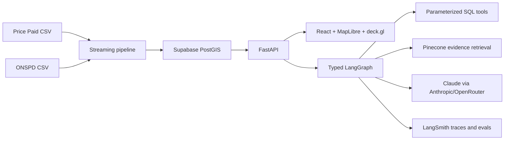

# London Property Explorer

Viewport-bounded exploration of HM Land Registry Price Paid Data joined to ONS postcode centroids, with deterministic PostGIS analytics and a grounded LangGraph assistant.

## Architecture



Transaction statistics come only from SQL. Pinecone contains curated methodology, provenance, licensing, limitations, and project documentation; transaction rows are never embedded.

## Local Setup

Requirements: Python 3.12+, Node 22.16. PostgreSQL/PostGIS is required for production parity; local map testing can use the SQLite read model below.

```bash
python3 -m venv .venv
.venv/bin/pip install -e '.[dev]'
cd frontend && npm ci
```

Build local real data from the two downloaded source files:

```bash
.venv/bin/python scripts/build_local_sqlite.py \
  --ppd ~/Downloads/pp-complete.csv \
  --onspd ~/Downloads/ONSPD_Online_Latest_Centroids_-966716609290186519.csv \
  --out data/local/lpe-local.sqlite3
```

Run the API and frontend with `DATABASE_URL` unset:

```bash
LOCAL_SQLITE_PATH=data/local/lpe-local.sqlite3 \
.venv/bin/uvicorn api.app.main:app --reload --port 8000
cd frontend && npm run dev
```

Open `http://127.0.0.1:5174`. The map will render real HMLR/ONS transactions locally. The local choropleth uses generated postcode-district bounding polygons for interaction testing; production uses proper district boundary GeoJSON loaded into PostGIS.

## Data Build

Production PostGIS load:

```bash
.venv/bin/lpe-pipeline \
  --ppd ~/Downloads/pp-complete.csv \
  --onspd ~/Downloads/ONSPD_Online_Latest_Centroids_-966716609290186519.csv \
  --district-source knowledge/downloads/uk-postcode-polygons/geojson/*.geojson \
  --output-dir pipeline/output

DATABASE_URL="$SUPABASE_ADMIN_DATABASE_URL" APP_READER_PASSWORD='...' \
  scripts/load_database.sh pipeline/output
```

The known source snapshot must produce 466,368 final rows. The pipeline aborts on count/domain drift, duplicate ONSPD keys, invalid retained coordinates, join coverage below 99.9%, or a loaded database at or above 450 MB. The loader publishes schema, data, metadata, precomputed low-zoom clusters, read-only-role credentials, counts, and size checks in one transaction; configure the API `DATABASE_URL` with the resulting `app_reader` credentials.

## Knowledge Index

```bash
PINECONE_API_KEY='...' .venv/bin/lpe-knowledge --version official-evidence-2026-06-13
```

Promotion requires a complete passing report:

```bash
.venv/bin/lpe-knowledge --version official-evidence-2026-06-13 \
  --promote --eval-report evals/results/official-evidence-2026-06-13.json
```

## Verification

```bash
.venv/bin/ruff format --check api pipeline evals scripts
.venv/bin/ruff check api pipeline evals scripts
.venv/bin/mypy api pipeline evals scripts
.venv/bin/pytest -q
PATH="$HOME/.nvm/versions/node/v22.16.0/bin:$PATH" npm --prefix frontend run lint
PATH="$HOME/.nvm/versions/node/v22.16.0/bin:$PATH" npm --prefix frontend test
PATH="$HOME/.nvm/versions/node/v22.16.0/bin:$PATH" npm --prefix frontend run build
PATH="$HOME/.nvm/versions/node/v22.16.0/bin:$PATH" npm --prefix frontend run e2e
```

Current local evidence: 39 Python tests and 4 frontend unit tests pass; 4 Playwright journeys pass across desktop and mobile. The app also runs locally against the generated 466,368-row SQLite read model. Supabase now contains the 466,368-row PostGIS snapshot, and OpenRouter SQL chat/SSE smoke passes locally against Supabase. Deployment smoke, Pinecone/LangSmith evals, and 24-hour/7-day durability checks remain unverified until deployed services exist.

## Limits And Licensing

- Point locations are postcode centroids, not building coordinates.
- The map returns at most 25,000 points per request and reports truncation.
- Price Paid Data coverage and exclusions follow HM Land Registry documentation.
- Source licensing metadata is stored on every Pinecone chunk. Verify downstream use against the Open Government Licence and each source's current terms.
- Assistant output is analytical, not financial, legal, valuation, or investment advice.

Deployment is defined in `render.yaml`; PostGIS is external on Supabase. Secrets stay server-side and are declared as unsynced Render environment variables.
